```{r setup, include=FALSE}
knitr::opts_chunk$set(echo = FALSE)

library(knitr)
library(ape)
library(RColorBrewer)
```


## Ancient DNA: today's lecture {.slide}

- Molecular phylogenetics
- Ancient DNA
- Sabretooth cats
- Sequencing the North Sea *Homotherium*

```{r, out.width = "45%", fig.align='right'}
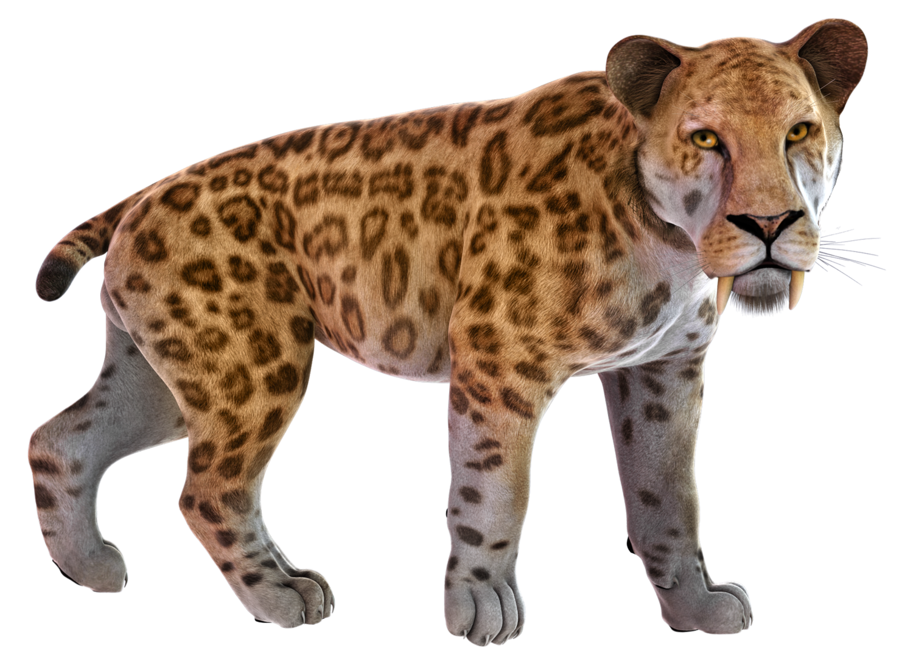
```

# Molecular phylogenetics

## Molecular phylogenetics {.flex-cols}
<!-- You've probably seen diagrams like this... -->

- This is called a **phylogeny**
- It represents the evolutionary process
- The phylogeny is like an evolutionary tree
- The **tips** are species
- **Nodes** are their common ancestors
- **Molecular phylogenies** are based on DNA data


```{r, out.width = 400, fig.width = 3, fig.height = 3, dpi = 600, fig.align = "right"}

my.tree <- read.tree(text="((((human,chimp),(cat,dog)),(snake,lizard)),fish);")
par(mar=c(0,0,0,0))
plot(my.tree)
```


## Mutation and inheritance creates the tree {.columns-2}


```{r, out.height = 300, fig.align='center'}
include_graphics("./img/dna-6560897.jpg")
```

- Human mutation rate ~1.1×10<sup>−8</sup> per site per generation
- Human: ~40 mutations in your 3.6 Gb genome


```{r, out.height = 300, fig.align='center'}
include_graphics("./img/inheritance_tree.svg")
```

- DNA divergence and time are (approximately) linearly related
- Branch lengths show the genetic divergence


## DNA sequence alignment

```{r, out.width = "75%", fig.align='center'}
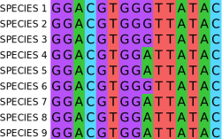
```


## Mitochondrial DNA is great for phylogenetics! {.columns-2}


```{r, out.width = "100%", fig.align='center'}
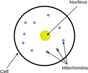
```

<br> 

<div style="height: 30px;"></div>

- Small genome (~16,000 base pair)
- High mutation rate
- Many copies per cell
- Maternally inherited
- No recombination

# Ancient DNA

## "Ancient DNA" is just old DNA

```{r, out.height = 500, fig.align='center'}
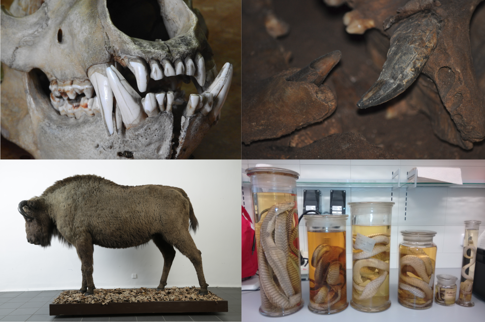
```


## Some samples don't fit in the lab!

```{r, out.height = 500, fig.align='center'}
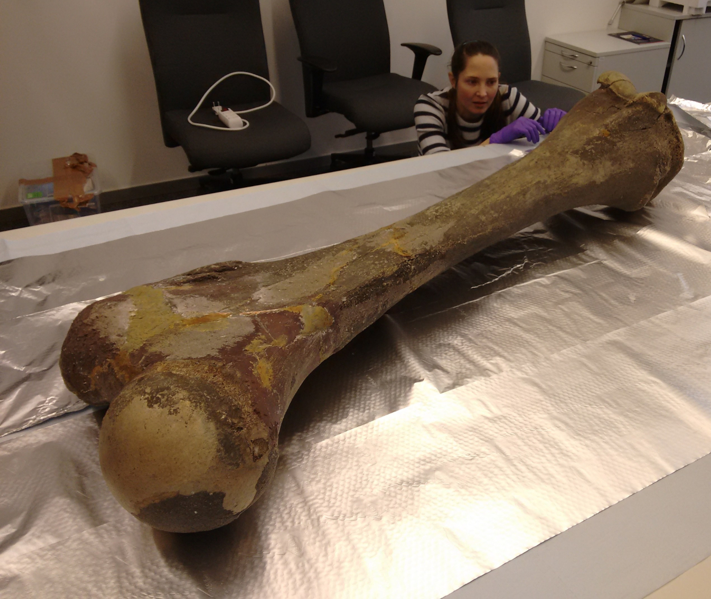
```


## Allows study of extinct species

```{r, out.height = 500, fig.align='center'}
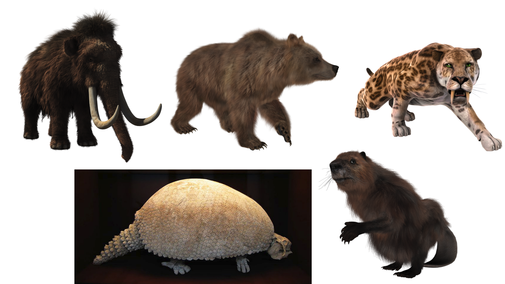
```

<p style="text-align: right;"><font size="3">*Glyptodont, WolfmanSF, CC BY_SA 3.0*</font></p>


## After thousands of years, most DNA is lost

```{r, out.height = 400, fig.align='center'}
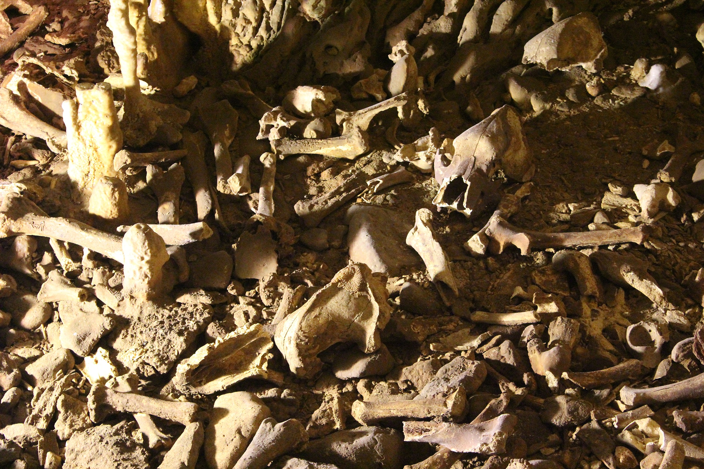
```

<p style="text-align: right;"><font size="3">*Zátonyi Sándor, CC BY-SA 3.0*</font></p>


## This makes the work contamination sensitive

```{r, out.height = 500, fig.align='center'}
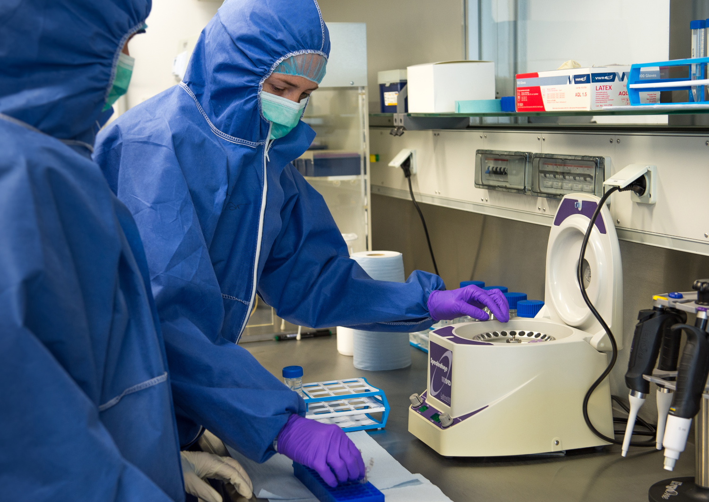
```

<p style="text-align: right;"><font size="3">*Copyright Karla Fritze, Potsdam University*</font></p>

## But the samples are already contaminated {.white-slide}

```{r, out.width = "60%", fig.width = 6, fig.height = 5, dpi = 600, fig.align = "center"}
par(mar=c(0,0,0,6))
my_slices <- c(1.1,14.4,0.73,17.3,66.52)
my_lab <- c("CAVE BEAR", "Prokaryotes", "other Eukaryotes", "undet. environmental", "unknown")
pie(my_slices, labels = my_lab, col=brewer.pal(6, "Set1"), cex=1.7)

```

<p style="text-align: right;"><font size="3">*Data from Noonan et al. 2005. Science*</font></p>


# Sabretooth cats


## There were multiple genera of sabretooth cats

- A **genus** is a group of closely related species. It's the first part of the scientific name
- e.g. ***Homo sapiens***

<div style="height: 30px;"></div>


```{r, out.width=950, fig.align='center'}
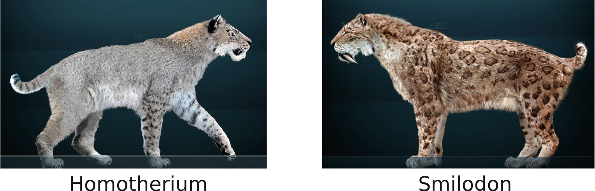
```


## *Smilodon* {.columns-2}

- The most commonly known group
- Massive canines
- Up to 400 kg and 120 cm shoulder height
- N and S America
- 3 species, *S. gracilis, S. populator, S. fatalis*
- Extinction 10 ka


```{r, out.width = "100%", fig.align='center', fig.cap="*Sergiodlarosa, CC BY-SA 3.0*"}
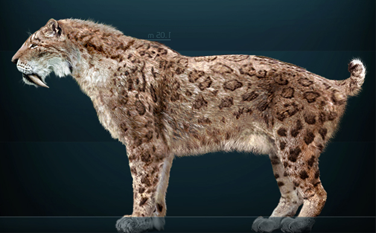
```


## *Homotherium* {.columns-2}

- Less known group
- Also known as scimitar-toothed cats
- Flat, serrated canines
- ~ 200 kg and 110 cm shoulder height
- Europe, Africa, N and S America
- Pleistocene Europe: *H. latidens*, extinction 300 ka
- Pleistocene N. America: *H. serum*, extinction 12 ka


```{r, out.width = "100%", fig.align='center', fig.cap="*Sergiodlarosa, CC BY-SA 3.0*"}
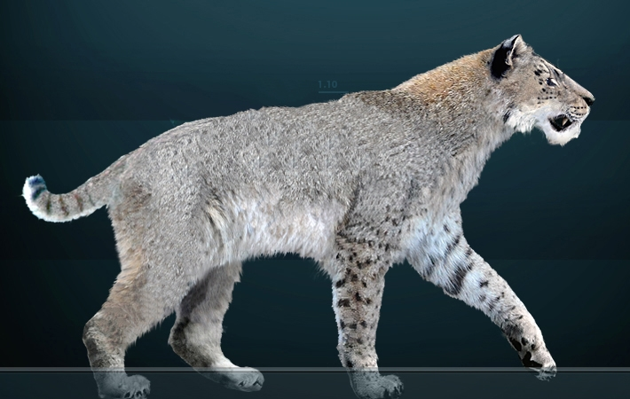
```


## *Homotherium* skull

```{r, out.height = 500, fig.align='center'}
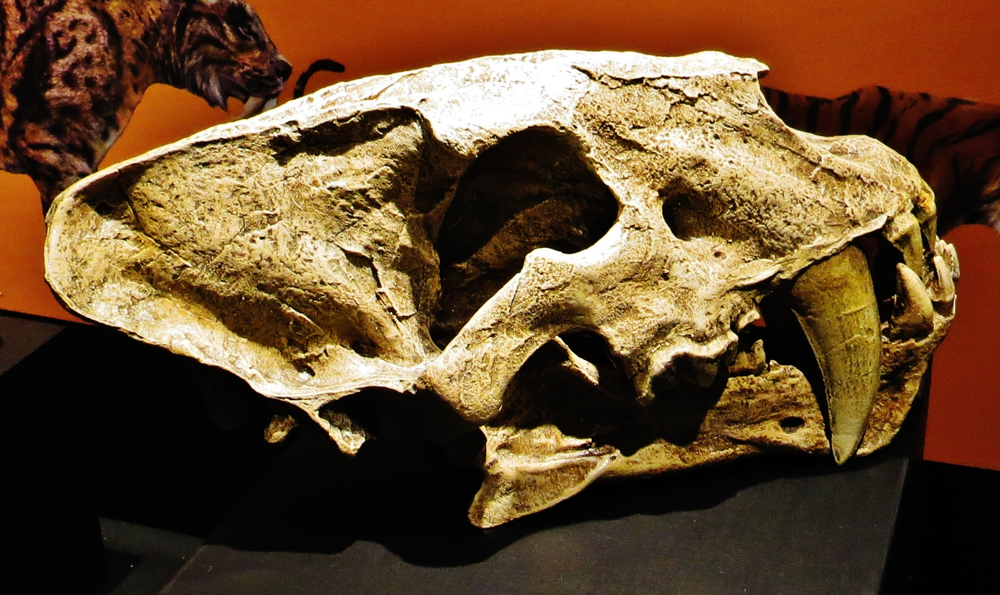
```

*Ghedoghedo, CC BY-SA 4.0*

## Pleistocene sabretooth cats

```{r, out.width = "100%", fig.align='center'}
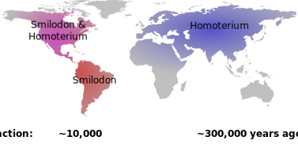
```

## Fishing for fossils


- Britain connected to mainland Europe by an area called **Doggerland**
- Rising sea levels 6-7 ka flooded the area, making Britain an island


```{r, out.width = "90%", fig.align='center'}
include_graphics("./img/Doggerland.svg")
```


## 16th March 2000, something turned up...

```{r, out.width = "90%", fig.align='center'}
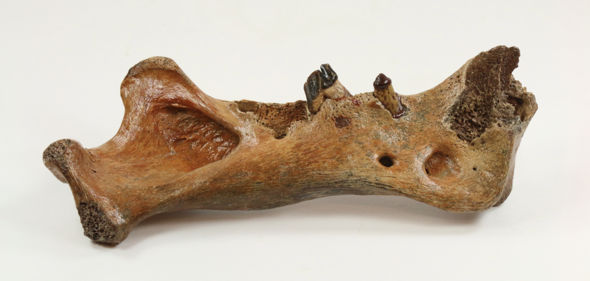
```

...this didn't look like a 300 ka fossil!


## Dating of the Dutch North Sea *Homotherium*

> - The bone was radiocarbon dated at 31,300 ± 400!
> - This was extraordinary, so the dating was repeated
> - New dates:
>     - 31,300 ± 400
>     - 26,900 ± 400
>     - 26,700 ± 240
>     - 28,100 ± 220
>     - 27,650 ± 280
> - The first Late Pleistocene European *Homotherium*


## Didn't fit in the picture!


```{r, out.width = "100%", fig.align='center'}
include_graphics("./img/smilo-homo_edit_withbone.svg")
```


# DNA analysis of North Sea *Homotherium*


## Sequencing of ancient DNA

```{r, out.width = "95%", fig.align='center'}
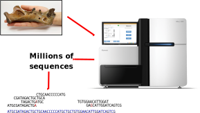
```


## Sequencing experiment 1

> - Total sequences = 2,628,309
> - *Homotherium* sequences grand total = 
> - 1 &nbsp;&nbsp;&nbsp; 😂


## DNA hybridisation capture {.flex-cols}

- DNA has 2 strands, arrange in a double helix
- It can be heat denatured
- When cooled, the single strands will stick (hybridise) to strands with a similar sequence
- We can "fish" target sequences from a pool of contaminants

<br>

```{r, out.height = 400}
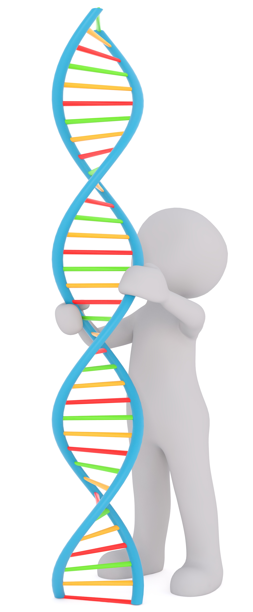
```


## DNA hybridisation capture*

```{r, out.width = "60%", fig.align='center'}
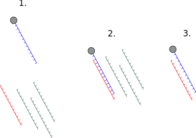
```


<p style="font-size: 33px;">***→ \*Of course this only works if you know the sequence in advance! ***</p>


## Mistaken identity {.columns-2}

*Meanwhile a Danish group were sequencing North American cave lion DNA*

<div style="height: 50px;"></div>

> - Sequence analysis showed it was actually a ***Homotherium***!

<div style="height: 50px;"></div>

> - This provided the sequence for the hybridisation cature baits

<br> 

```{r, out.width = "100%", fig.align='center'}
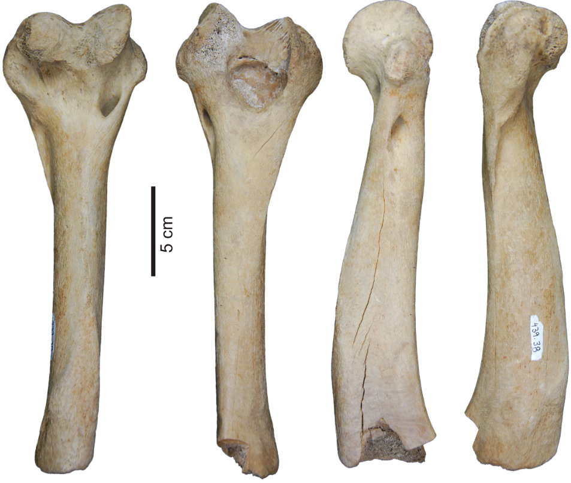
```


## Sequencing experiment 2 <br> (hybridisation capture)

> - Total sequences = 72,759,982
> - *Homotherium* sequences grand total = 
> - 12,050,089 &nbsp;&nbsp;&nbsp; 🎉


## Phylogenetic analysis of sabretooth cats

```{r, out.width = "95%", fig.align='center'}
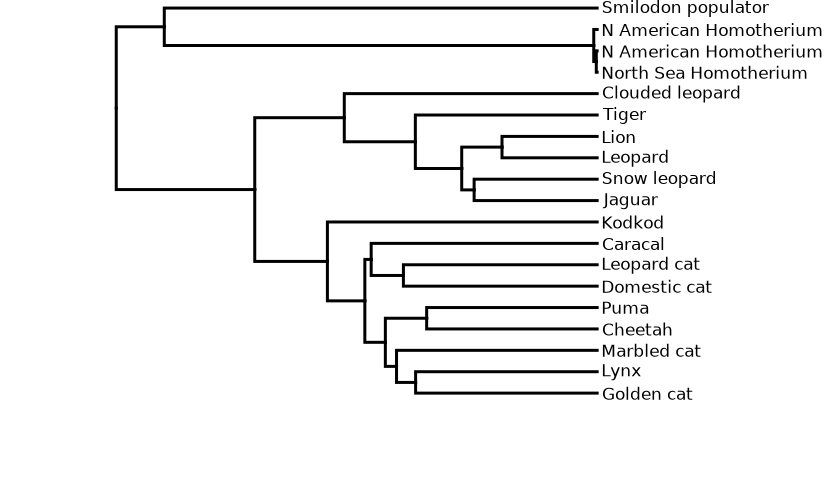
```


## Mutation and inheritance creates the tree {.columns-2}

```{r, out.width = 300, fig.align='center'}
include_graphics("./img/dna-6560897.jpg")
```

- Human mutation rate ~1.1×10^−8 per site per generation
- Human: ~40 mutations in your 3.6 Gb genome
- inherited by offspring

<br>

```{r, out.width = 300, fig.align='center'}
include_graphics("./img/inheritance_tree.svg")
```

- DNA divergence and time are (approximately) linearly related
- Branch lengths show the genetic divergence


## Molecular dating of sabretooth cats


```{r, out.width = "95%", fig.align='center'}
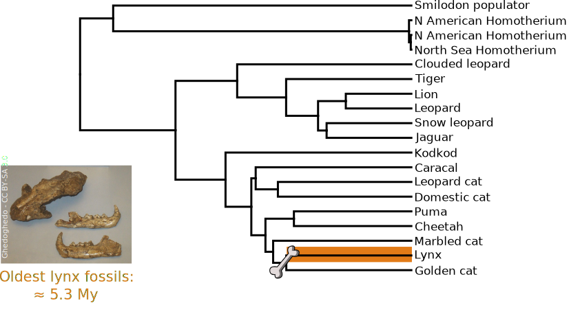
```

## Molecular dating of sabretooth cats

```{r, out.width = "95%", fig.align='center'}
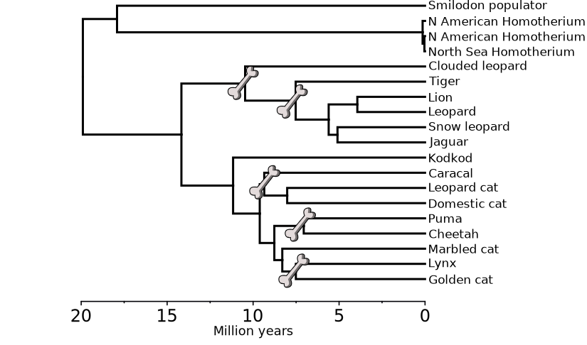
```


## Molecular dating of sabretooth cats

- Sabretooths divergence from living cats 20 Ma
- *Homotherium* and *Smilodon* were more diverged from one another than any living cats
- A huge diversity was lost with the extinction of the sabretooths
- North American and European *Homotherium* were genetically similar
- We recommended they be treated as a single species, *H. latidens*

```{r, out.width = "45%", fig.align='right'}

```


## Paijmans et al. 2017

```{r, out.width = "100%", out.height=500}
include_graphics("./pdf/Paijmans et al. - 2017.pdf")
```


# Thank you for listening!


<p style="color: silver; font-size: 30px;">***Ancient DNA: unlocking the secrets of extinct animals***</p>

<p style="color: silver">Dr. Johanna Paijmans</p>

[j.paijmans@bangor.ac.uk](mailto:j.paijmans@bangor.ac.uk)

<div style="height: 130px;"></div>

```{r, out.width = "45%", fig.align='right'}
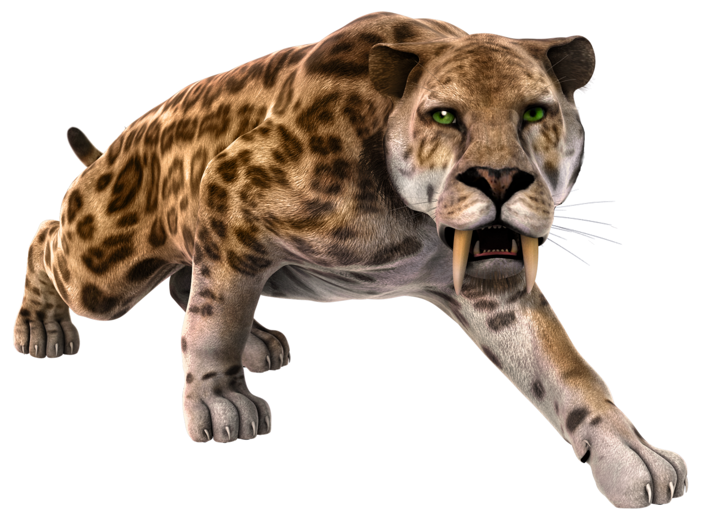
```

